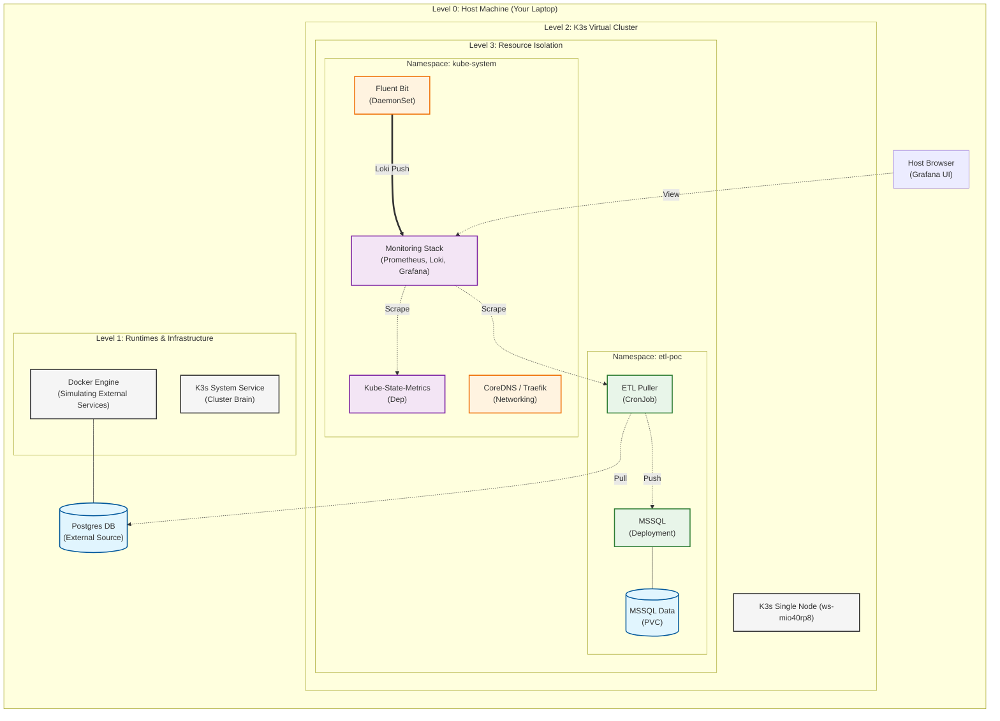

# System Architecture: Top-Down View

This document provides a bird's-eye view of how the POC is structured across your laptop, the K3s cluster, and the individual components.

## 1. Visual System Map

This diagram illustrates the hierarchy from your physical machine down to the smallest containerized process.

---

## 2. Deployment Details & Statefulness

| Component | K8s Kind | Namespace | Statefulness | Role |
| :--- | :--- | :--- | :--- | :--- |
| **ETL App** | `CronJob` | `etl-poc` | **Stateless** | Runs Python logic to sync data every 5 mins. |
| **MSSQL** | `Deployment` | `etl-poc` | **Stateful** | Relational DB. Stores persistent data in a PVC. |
| **Prometheus** | `Deployment` | `kube-system` | **Stateful** | Metric storage and scraping engine. |
| **Loki** | `Deployment` | `kube-system` | **Stateful** | Log storage and indexing. |
| **Grafana** | `Deployment` | `kube-system` | **Stateless** | Visualization portal (connected to P&L). |
| **Fluent Bit** | `DaemonSet` | `kube-system` | **Stateless** | Log harvester; ships container logs to Loki. |
| **KSM** | `Deployment` | `kube-system` | **Stateless** | Kube-State-Metrics; converts K8s API objects to Prometheus metrics. |
| **Networking** | `Deployment` | `kube-system` | **Stateless** | CoreDNS and Traefik Ingress Controller. |
| **External DB** | `Container` | `Docker` | **Stateful** | Simulates the source ERP/external database. |

> ***Note on Persistence**: "Stateless" in Kubernetes doesn't mean it doesn't do anything—it means the **Pod** is disposable. If you lose a Pod, K8s makes a new one from the Blueprint (Image). **State** is only kept if it's stored in a **Volume (PVC)**.*
